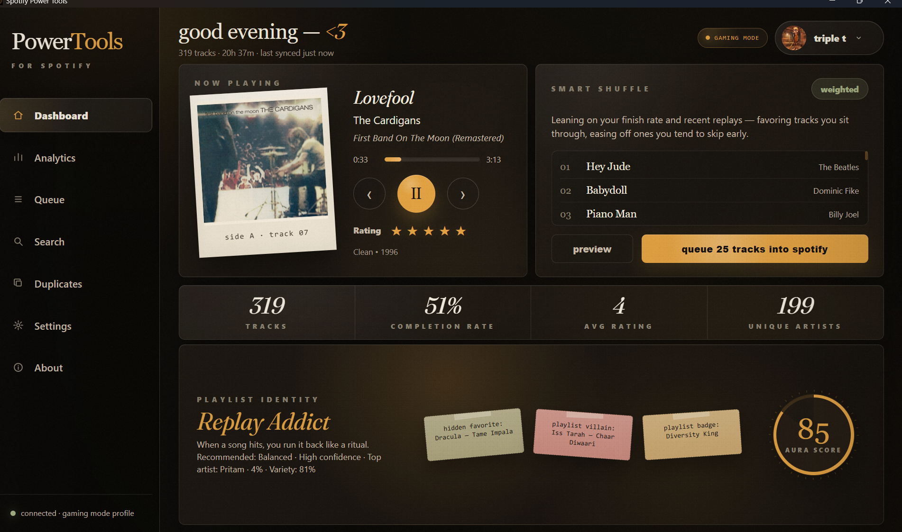
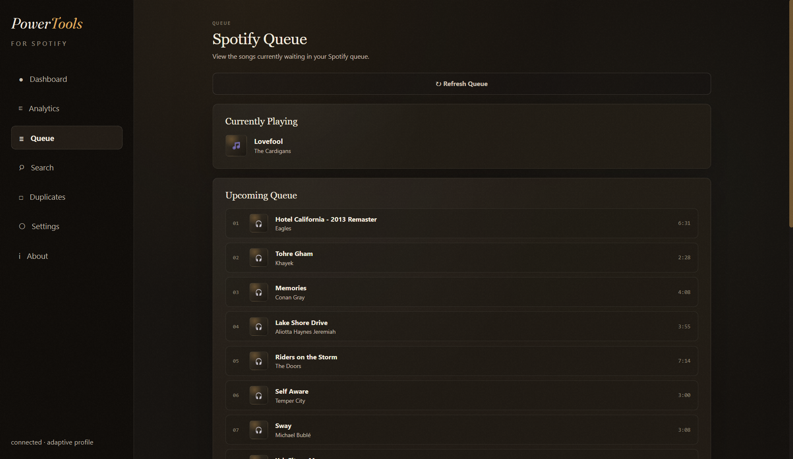
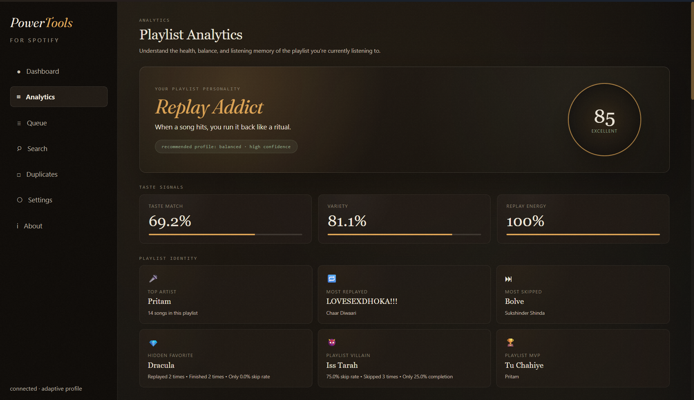
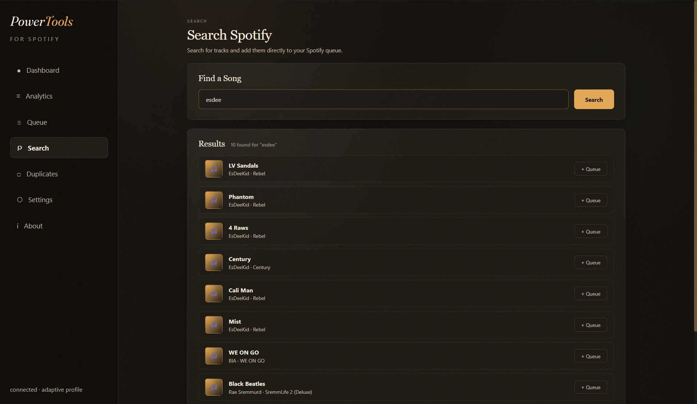
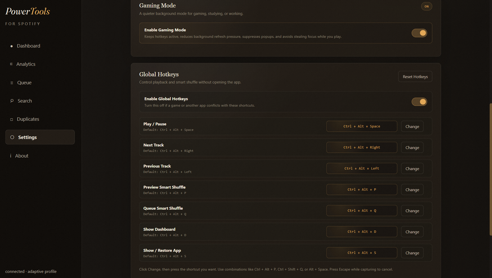
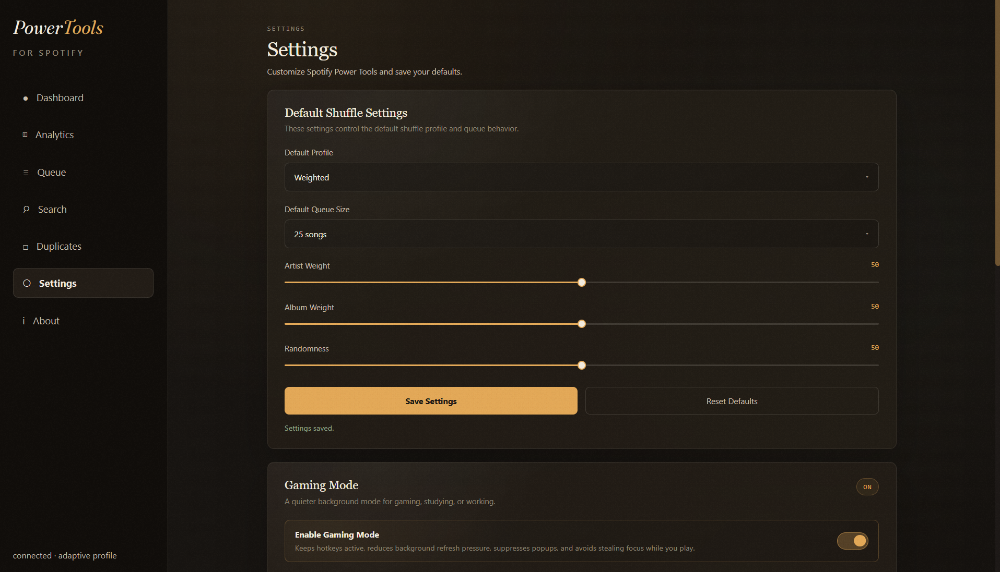
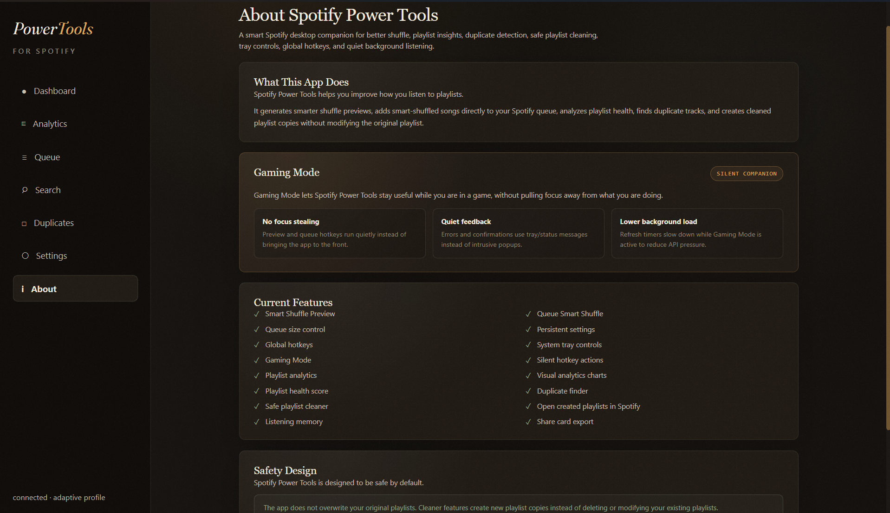

# Spotify Power Tools

Spotify Power Tools is a premium desktop companion for Spotify that makes playlist listening smarter, more explainable, and more controllable.

It combines intelligent shuffle generation, Spotify queue control, playlist analytics, duplicate detection, listening-memory insights, global hotkeys, system tray controls, and a quiet Gaming Mode inside a polished PySide6 desktop interface.



## Why I Built This

Spotify shuffle can feel repetitive, especially in large playlists where the same artists, albums, or recently played songs appear too often.

Spotify Power Tools solves that by giving the listener more control over what comes next. It analyzes the current playlist, builds smarter queue previews, explains the shuffle logic, and lets the user queue a better listening sequence directly into Spotify.

## Features

### Smart Shuffle

Spotify Power Tools generates smarter shuffle previews from the currently playing Spotify playlist.

Supported shuffle profiles:

- Balanced
- Discovery
- Adaptive
- Album
- Random
- Weighted
- Custom

The shuffle engine can use artist repetition, album repetition, local ratings, recent listening behavior, skip patterns, replay behavior, and configurable randomness.

### Queue Smart Shuffle

The app can add smart-shuffled songs directly to the Spotify queue.

Queue size is configurable:

- 10 songs
- 25 songs
- 50 songs
- 100 songs



### Playlist Analytics

The analytics page summarizes playlist health, taste signals, replay energy, variety, average rating, and playlist personality.



### Playlist Identity

Spotify Power Tools creates a fun identity layer for playlists, including:

- Aura score
- Playlist personality
- Hidden favorite
- Playlist villain
- Playlist badge
- Top artist
- Most replayed song
- Most skipped song
- Playlist MVP

### Listening Memory

The app stores local listening memory so shuffle decisions can become more personalized over time.

It tracks:

- Started songs
- Finished songs
- Skipped songs
- Replayed songs
- Recent tracks
- Track ratings
- Listening-memory signals used by adaptive shuffle

Listening memory is local app data and does not modify Spotify playlists.

### Search + Queue

The Search page lets the user search Spotify tracks and add songs directly to the queue.



### Duplicate Finder and Safe Cleaner

Spotify Power Tools can analyze duplicate tracks and create a cleaned playlist copy.

The original playlist is not overwritten or modified.

### Global Hotkeys

The app supports configurable global hotkeys for:

- Play / Pause
- Next track
- Previous track
- Preview Smart Shuffle
- Queue Smart Shuffle
- Show Dashboard
- Show / Restore App



### System Tray Integration

The app can stay running in the system tray and respond to hotkeys and tray-menu actions.

### Gaming Mode

Gaming Mode is a quiet background mode for gaming, studying, or working.

When Gaming Mode is enabled:

- Hotkeys stay active
- Background refresh slows down
- Shuffle hotkeys do not steal focus
- Popups are suppressed
- Feedback is sent through tray/status messages
- The app can stay quietly in the tray



### Premium Desktop Interface

The UI uses a custom warm editorial visual style with:

- Dark vintage theme
- Amber accents
- Serif display typography
- WebEngine-based pages
- Film-grain overlay
- Custom app/tray icons
- Polaroid-style album art treatment



## Tech Stack

- Python
- PySide6
- Qt WebEngine
- Qt WebChannel
- Spotipy
- Spotify Web API
- Local JSON persistence
- Global keyboard hotkeys
- System tray integration
- Git + GitHub

## Requirements

- Python 3.12+
- Spotify Premium
- A Spotify Developer app
- Windows recommended for global hotkeys and tray behavior

## Installation

Clone the repository:

```bash
git clone https://github.com/YOUR_USERNAME/SpotifyPowerTools.git
cd SpotifyPowerTools
```

Create and activate a virtual environment:

```bash
python -m venv .venv
.venv\Scripts\activate
```

Install dependencies:

```bash
pip install -r requirements.txt
```

Create a `.env` file in the project root:

```env
SPOTIPY_CLIENT_ID=your_client_id_here
SPOTIPY_CLIENT_SECRET=your_client_secret_here
SPOTIPY_REDIRECT_URI=http://127.0.0.1:8888/callback
```

In the Spotify Developer Dashboard, add the same redirect URI:

```text
http://127.0.0.1:8888/callback
```

Run the app:

```bash
python src/main.py
```

## Spotify Permissions

Typical Spotify scopes used by this app include:

```text
user-read-playback-state
user-modify-playback-state
playlist-read-private
playlist-read-collaborative
user-read-currently-playing
user-read-private
```

## Privacy and Safety

Spotify Power Tools is designed to be safe by default.

- It does not store Spotify passwords.
- It does not overwrite original playlists.
- Cleaner actions create new playlist copies.
- Ratings and listening memory are stored locally.
- Runtime files such as settings, cache, and listening memory should not be committed to Git.
- `.env` and Spotify auth cache files must stay private.

Important local files that should remain ignored:

```text
.env
.spotify_power_tools_cache
data/settings.json
data/listening_history.json
data/song_ratings.json
data/share_cards/
```

## Project Structure

```text
SpotifyPowerTools/
├── src/
│   ├── controllers/
│   ├── gui/
│   │   ├── web/
│   │   └── resources/
│   ├── services/
│   ├── shuffle/
│   ├── workers/
│   └── main.py
├── assets/
│   └── screenshots/
├── data/
├── requirements.txt
└── README.md
```

## Current Version

```text
v0.9.0
```

## Roadmap

- Windows `.exe` packaging
- Installer build
- Mini Player Mode
- More advanced listening-memory dashboard
- More playlist intelligence cards
- Optional import/export of settings
- Lightweight Spotify API cooldown handling
- Better onboarding for Spotify Developer setup
- GitHub releases with packaged builds

## Resume Summary

Spotify Power Tools is a Python/PySide6 desktop application integrated with the Spotify Web API. It improves playlist listening through intelligent shuffle generation, explainable queue previews, local listening-memory analytics, playlist health insights, duplicate detection, configurable global hotkeys, system tray controls, and a Gaming Mode that prevents focus stealing during gameplay.

## Status

Active portfolio project.
